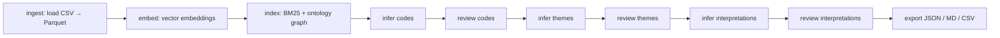

# Resilience Scoping Review and Thematic Analysis Pipeline

A local-first, ontology-guided pipeline for qualitative thematic analysis.
It turns a corpus of literature excerpts tagged against a hierarchical
ontology into validated **codes → themes → interpretations**, with a
human-in-the-loop review at every stage.

The pipeline runs entirely on your machine (works on 8 GB RAM laptops),
uses LLM inference (Groq) for constrained coding, and combines semantic
embeddings, BM25 lexical search, and ontology structure for retrieval.
Only inference calls require network access; everything else is local.

---

## Quick start

### 1. Prerequisites

- [git](https://git-scm.com/downloads)
- [mamba](https://mamba.readthedocs.io/) or conda/miniconda
- A [Groq API key](https://console.groq.com/keys) (free tier is enough
  for this corpus)

### 2. Clone and create the environment

```bash
git clone https://github.com/namakala/resilience-scoping-review && cd resilience-scoping-review
mamba env create -f environment.yaml   # creates the `qda` environment
mamba activate qda
```

### 3. Configure secrets

```bash
cp .env.example .env
# edit .env and set GROQ_API_KEY=<your key>
```

The defaults in `.env` are correct for this repository. You only need
to fill in the API key. All options are documented in `.env.example`.

### 4. Run the analysis

```bash
python analyze.py ingest    # load data/raw CSV files into the local session
python analyze.py run       # run all stages; stop at each review prompt
python analyze.py export    # write results to data/output/
```

`run` performs inference and then pauses for review at each stage.
At the final review, approved artifacts are finalized; the exported
results land in:

- `data/output/results.json`: machine-readable (interpretations, themes, codes, evidence)
- `data/output/results.md`: human-readable narrative report
- `data/output/results.csv`: tabular export

Resume anytime: the pipeline saves checkpoints, so re-running the same
command picks up where you left off. Use `--no-resume` to start fresh.

---

## What's this all about?

The input is a set of **exemplars**: short excerpts from the literature,
each tagged with a node from a hierarchical **tag ontology**
(e.g. `Problem.Cause`, `Problem.Impact.Mechanism`). The pipeline
iteratively abstracts upward:

```
exemplars ──→ codes ──→ themes ──→ interpretations
   (evidence)  (per exemplar)  (per tag)   (across tags)
```

Stage flow (governed by a state machine, resumed from checkpoints):



Design principles (full rationale in `@ADR.md`):

- **Graph-centric (ADR-004)**: codes, themes, and interpretations are
  graph nodes with explicit edges, so lineage is always traceable.
- **Hybrid retrieval (ADR-006)**: BM25 lexical + embedding cosine +
  ontology proximity, fused into a ranking used as LLM context.
- **Incremental evolution (ADR-007)**: a dirty-state mechanism
  recomputes only the ontology branches affected by your edits; clean
  tags cost zero LLM calls on re-runs.
- **Human in the loop (ADR-011)**: nothing is final until you approve,
  edit, merge, or reject it in the review UI.

---

## Input data

After `ingest`, exemplars are converted to Parquet and content-hashed so
changes are detected on re-ingest.

**`data/raw/data.csv`**: exemplars (one row per excerpt):

```csv
id,document,tag,content
7548609,D-01-resilience-stress-latinx-immigrants.md,Problem.Cause,"Individuals in minority positions experience multiple adverse conditions"
```

| column   | meaning                                              |
|----------|------------------------------------------------------|
| `id`     | unique excerpt identifier                            |
| `document` | source document filename                          |
| `tag`    | ontology node for this excerpt (`dot`-separated)     |
| `content`| the excerpt text                                     |

**`data/raw/tags.csv`**: tag ontology (hierarchical namespace):

```csv
tag,description,n_contents
Problem,Arising issues related to psychological health and mental well-being.,0
Problem.Cause,Potential cause of the identified problem.,22
```

| column        | meaning                                  |
|---------------|------------------------------------------|
| `tag`         | full dotted path (`Parent.Child`)        |
| `description` | semantic definition used as LLM context  |
| `n_contents`  | exemplar count (reconciled at ingest)    |

---

## CLI reference

All commands take global options first, e.g.
`python analyze.py --data my.csv --tags my-tags.csv run --type code`.

```
python analyze.py [GLOBAL OPTIONS] COMMAND [ARGS]

Commands:
  ingest     Load CSV data into the DuckDB session (→ Parquet)
  run        Run pipeline stages with HITL validation
  export     Export approved codes, themes, interpretations
  benchmark  Compare machine output against human-coded benchmarks
```

**Global options**

| option | meaning |
|--------|---------|
| `--data FILE` | exemplars CSV (overrides defaults) |
| `--tags FILE` | tags CSV (overrides defaults) |
| `--env FILE`  | custom `.env` file (overrides default) |
| `--resume / --no-resume` | resume from last checkpoint (default: resume) |
| `--force-resume` | ignore config version mismatch and resume |

**`run` options**

| option | meaning |
|--------|---------|
| `--type code\|theme\|interpretation` | run only these stages (repeatable) |
| `--all` | run all stages (default) |
| `--limit N` | process only the N tags with fewest exemplars (0 = all) |
| `--force` | hard-delete existing artifacts before re-inferring (requires `--type`) |
| `--tui / --no-tui` | force TUI or plain CLI review mode |
| `--quiet` / `--verbose` | output verbosity |
| `--dry-run` | validate config without executing |

**`benchmark` options**

| option | meaning |
|--------|---------|
| `--source FILE` | human-coder benchmark CSV (repeatable, required) |
| `--output FILE` | benchmark report path (JSON) |
| `--bootstrap N` | bootstrap iterations for confidence intervals (0 = skip) |

No subcommand defaults to the review TUI. Running the CLI with no
command and no existing artifacts prompts you to run the pipeline first.

---

## Environment configuration

Configuration comes from `.env` (see `.env.example` for the full
catalog). Precedence: CLI flags > `--env FILE` > `.env` > defaults.

Key variables:

| variable | default | purpose |
|----------|---------|---------|
| `GROQ_API_KEY` | - | **required**; LLM inference provider |
| `DEFAULT_MODEL` | `openai/gpt-oss-120b` | LLM model for all stages |
| `CODE_MODEL` / `THEME_MODEL` / `INTERPRETATION_MODEL` | fall back to `DEFAULT_MODEL` | per-stage model overrides |
| `CODE_TEMPERATURE` | `0.3` | stage temperatures (`THEME_` 0.4, `INTERPRETATION_` 0.5) |
| `EMBEDDING_MODEL` | `all-MiniLM-L6-v2` | local sentence-transformer |
| `BATCH_SIZE` | `15` | exemplars per Groq call |
| `SIMILARITY_SCORE_THRESHOLD` | `0.8` | auto-assign exemplars to existing codes above this score |
| `DATA_PATH` / `TAGS_PATH` | `data/raw/{data,tags}.csv` | input paths |
| `EXPORT_OUTPUT_PATH` | `data/output` | results directory |

Embedding models are cached locally (default
`~/.cache/huggingface/hub`): first run downloads the MiniLM model once;
set `HF_HUB_OFFLINE=1` afterward to skip network checks.

---

## Reproducibility & iterative work

- **Resume**: sessions persist checkpoints in a DuckDB session table.
  Re-running after an interruption continues from the last finished
  stage.
- **Dirty-state propagation**: approving/editing an artifact marks only
  its ontology branch dirty; downstream stages recompute just those
  branches. This keeps iterative coding cheap on later passes.
- **Force re-inference**: `run --type code --force` hard-deletes
  existing codes before re-inferring, when you want a clean slate.
- **Change detection**: re-ingesting a modified CSV detects content
  changes via hashes and prompts before overwriting.

Cost tracking is built in: per-stage token usage and estimated USD cost
are logged (`data/output/token_usage.log`); set `MAX_STAGE_COST_USD`
to warn above a budget.

---

## Project layout

```
analyze.py                 CLI entry point
environment.yaml           mamba environment spec (`qda` env)
src/python/
  orchestration/           CLI, state machine, runner, export
  ontology/                tag DAG, traversal caches, constraints
  semantic/                embeddings, BM25, hybrid retrieval
  inference/               Groq batching, prompts, structured parsing
  hitl/                    CLI/TUI review, mutations, undo/redo
  graph/                   low-level node/edge CRUD
  persistence/             DuckDB schema, Parquet, caching
data/raw/                  inputs (data.csv, tags.csv)
data/processed/            Parquet artifacts, embeddings, DuckDB
data/output/               results + logs
docs/                      ADRs, feature plans, methods, results
tests/                     unit + integration tests
```

---

## Documentation

- `@ADR.md`: architecture decision records (graph-centric, hybrid
  retrieval, incremental evolution, HITL, …)
- `@AGENTS.md`: agentic documentation index for the system
- `docs/plan/`: per-feature specifications and implementation status
  (`@PLANS.md`)
- `docs/methods-thematic-analysis/`: method write-ups behind this pipeline
- `docs/results-thematic-analysis/`, `docs/results-knowledge-graph/`,
  `docs/results-benchmark/`: current and draft results

## Legacy R pipeline

The earlier `R`/`targets`/quarto pipeline for statistical analysis is
still described in `README.qmd` and reproduced via
`renv::restore()` + `targets::tar_make()`.
