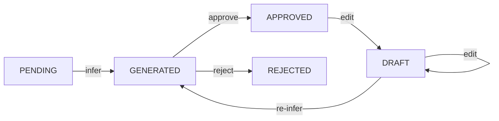

# Code Inference & Review

End-to-end pipeline for the code stage: exemplars → LLM inference generates candidates → HITL review validates, edits, merges, or rejects. The inference_status table bridges both phases.

## Purpose & Design Rationale

Combines LLM batch inference (ADR-010) with researcher validation (ADR-011). The LLM acts as constrained interpreter — given exemplar evidence and ontology context, it outputs structured JSON code candidates. The researcher retains interpretive control via interactive CLI review. Dirty-state propagation (ADR-007) ensures code edits cascade to themes and interpretations downstream.

## Generate Phase (Inference)

`infer_codes(con, tag)` is the entry point:

1. **Load pending:** `get_pending_items(stage=code, status=pending|draft)` filters only unprocessed or reworked exemplars.
2. **Batch by tag:** `group_by_tag(max_per_batch=15)` produces deterministic batches sorted by tag then exemplar id.
3. **Render prompt:** Per batch, fetch ontology path + tag description + existing approved codes; render Jinja2 prompt with few-shot demonstrations.
4. **Call Groq:** `infer_batch_with_retry()` — three-tier retry (network backoff, 429 sleep, token-limit batch splitting).
5. **Parse response:** Strip fences, `json.loads`, unwrap from `"codes"` key, validate against `CodeInference` Pydantic model.
6. **Dedup + persist:** Dedup by exemplar_id; `mark_success()` transitions to `generated`; `mark_failure()` leaves `pending`.

TokenTracker records per-call usage and warns if stage cost exceeds threshold.

## Validate Phase (Review)

`review_codes(con, db_path)` iterates pending codes via interactive CLI:

1. **Fetch draft codes:** SQL `WHERE type='code' AND status='draft' ORDER BY id`.
2. **Display:** `rich.Panel` (name, definition, supporting quote, tag) + `rich.Table` of semantic neighbor codes with similarity scores.
3. **Prompt:** `questionary.select`: Approve, Edit, Merge, Reject, Defer, More context.
4. **Dispatch:** Action handlers update graph and `inference_status`; each action logs to `user_actions` audit table.

## Status Lifecycle

The `inference_status` table is the shared bridge between inference and review:

`get_pending_items(stage=code)` returns entities with `pending` or `draft` status, ensuring only unprocessed or reworked exemplars re-enter the inference phase.

## Key Actions

Five atomic handlers. All update the graph and write to `user_actions`:

**Approve:** Node status → `approved`; `set_status(APPROVED)`. Enables theme inference for this tag.

**Edit:** Definition updated; node → `draft`; `set_status_draft()`; `invalidate_code_embedding()` (deletes embedding cache + sets dirty flag). Downstream themes/interpretations become draft via cascade.

**Merge:** `handle_merge(source → target)` — DuckDB transaction with NetworkX snapshot/restore. Redirects `contains` edges; merges `exemplar_ids` + `supporting_quotes` into target `data_json`; creates `derived-from` edge; `invalidate_themes()` + `invalidate_interpretations()`. Source marked `merged`.

**Reject:** Node status → `rejected`; `set_status(REJECTED)`. Code excluded from downstream stages.

**Defer:** Log action only; no status change. Re-prompted on next review session.

## File Map

**Generate phase** (`src/python/inference/`): `code_inference.py`, `batch_processor.py`, `batching.py`, `parsing.py`, `retry.py`, `groq_client.py`, `prompts.py` + `templates/`, `status_updates.py`, `tag_context.py`, `fewshot_loader.py`, `inference_status_crud.py`, `inference_status_queries.py`, `inference_status_types.py`, `tracking.py`, `code_node_creation.py`, `exemplar_node_creation.py`.

**Validate phase** (`src/python/hitl/`): `code_review.py`, `code_review_actions.py`, `code_review_merge.py`, `code_review_prompts.py`, `code_review_display.py`, `code_review_queries.py`, `merge_invalidation.py`, `edits.py`, `user_action_log.py`.

## Integration

Depends on ontology layer (tag paths, descriptions, traversal caches), semantic layer (neighbor retrieval for review context), graph layer (node/edge CRUD, transaction support), and persistence layer (exemplar parquet, embedding cache, state persistence).

Feeds into theme inference — approved codes per tag become `composed-of` edges for theme generation — then interpretation synthesis across tags.

## References

Implements ADR-010 (LLM Inference), ADR-011 (HITL Validation), ADR-007 (Incremental Evolution). See `@ADR.md` for architectural rationale. See `@docs/feature/inference-layer.md` for full inference-layer details.
