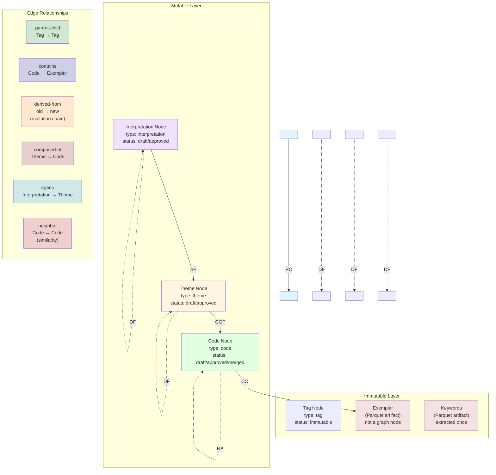

# Graph Data Model

## Overview

**Key design decision:** Exemplars are **not graph nodes**—they remain in Parquet files. Codes link to exemplars via `contains` edges, keeping the graph lean while preserving full traceability.

## Node Type Catalog

| Type | Mutability | Purpose |
|------|-----------|---------|
| `tag` | **Immutable** | Ontology namespace (e.g., `Problem`, `Problem.Cause`) |
| `code` | **Mutable** | Pattern derived from exemplars; status: draft → approved → merged/rejected |
| `theme` | **Mutable** | Aggregates codes within same tag; status: draft → approved → deprecated |
| `interpretation` | **Mutable** | Cross-tag synthesis; status: draft → approved → rejected |

Nodes stored in `nodes` table (DuckDB) and mirrored in NetworkX `DiGraph`. See `src/python/persistence/duckdb_schema.py` for full DDL.

## Edge Type Catalog

| Edge Type | Source → Target | Direction | Purpose |
|-----------|----------------|-----------|---------|
| `parent-child` | tag → tag | Directed | Ontology hierarchy; forms a DAG |
| `contains` | code → exemplar | Directed | Evidence linkage; code supported by exemplar |
| `derived-from` | code→code, theme→theme, interpretation→interpretation | Directed | Evolution chain; tracks revisions |
| `composed-of` | theme → code | Directed | Aggregation; theme aggregates codes (same-tag constraint) |
| `spans` | interpretation → theme | Directed | Semantic coverage; interpretation spans multiple tags |
| `neighbor` | code ↔ code | Undirected (stored as two directed edges) | Context for HITL review; similar codes |

Edges stored in `edges` table with composite PK `(source_id, target_id, edge_type)` and optional JSON `metadata_json`.

## Key Principles

- **One code → One theme:** Each `code` node has exactly one `composed-of` outgoing edge to a `theme` node
- **One theme → One interpretation:** Each `theme` node has exactly one `spans` outgoing edge to an `interpretation` node
- **Same-tag constraint:** All codes connected to a theme via `composed-of` must have the same `tag` value
- **Contiguous subtree:** `tag_spans` in `data_json` must form a connected sub-DAG
- **No cycles:** Tag DAG must remain acyclic; merge operations validated before edge creation
