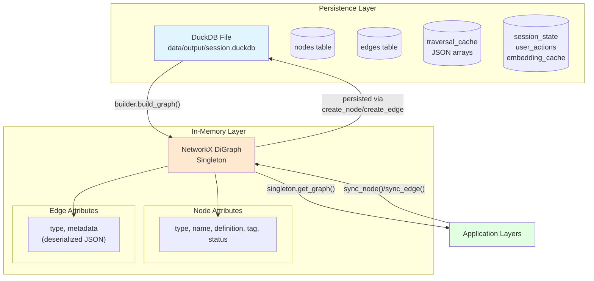
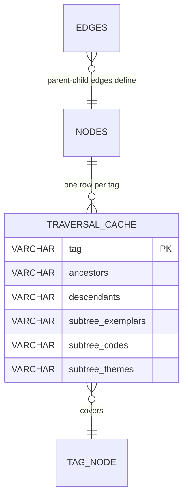

# Graph Dual Representation

The knowledge graph uses a dual-model approach: NetworkX for fast in-memory traversal, DuckDB for durable storage.

## Architecture

## Graph Lifecycle

1. **Lazy initialization** — First `get_graph()` call triggers `builder.build_graph(con)` which queries all `nodes` and `edges` from DuckDB and constructs a NetworkX `DiGraph`
2. **Singleton caching** — Graph cached globally; subsequent calls return same object (no rebuild)
3. **Explicit rebuild** — `rebuild_graph()` clears cache and reconstructs from DuckDB (useful after bulk mutations)
4. **Incremental sync** — After individual mutations, `sync_node(id)` and `sync_edge(source, target, type)` fetch the latest row from DuckDB and upsert into the in-memory graph

> **Performance target:** <5 seconds to build a 10,000-node graph (verified by unit test). See `graph-usage-performance.md` for full benchmarks.

## Traversal Caching (ADR-012)

Repeated subtree traversals during interpretation synthesis are expensive. Commonly used traversal results are materialized:

**Cached fields** per tag:
- `ancestors`: all parent tags up to root (for inheritance)
- `descendants`: all child tags down to leaves (for scope)
- `subtree_exemplars`: aggregated exemplar IDs in the tag's entire subtree
- `subtree_codes`: aggregated code IDs in subtree
- `subtree_themes`: aggregated theme IDs in subtree

**Invalidation policy** — Cache invalidated incrementally when:
- New tag added/modified (parent-child edge changed)
- Code moved to different tag
- Theme composition changes
- Only affected tag branches are recomputed (not the entire cache)
