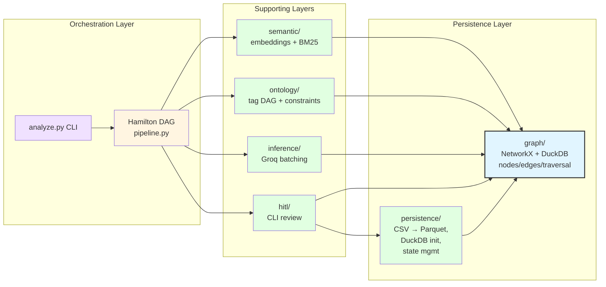

# Graph Integration & Constraints

The knowledge graph integrates with all system layers and enforces structural invariants.

## System-Wide Integration

## Layer Responsibilities

| Layer | Graph Usage |
|-------|-------------|
| **Persistence** | DuckDB schema (`nodes`, `edges`, `traversal_cache`); artifact loading |
| **Graph Module** | NetworkX construction, singleton, sync, (planned) CRUD APIs |
| **Ontology** | Tag DAG traversal, constraint validation (one-code-one-theme, etc.) |
| **Semantic** | Scope restriction (tag subtree queries), neighbor discovery |
| **Inference** | Prompt context (ontology path, existing codes/themes), write results |
| **HITL** | Present graph context (ancestors/descendants, evidence chains), persist mutations |
| **Pipeline** | Dirty flag propagation, selective DAG recomputation |

## Constraint Validation (ADR-013)

The graph enforces structural invariants through edge patterns:

| Constraint | Enforcement Mechanism |
|------------|----------------------|
| **One code → One theme** | Each `code` node has exactly one `composed-of` outgoing edge to a `theme` node |
| **One theme → One interpretation** | Each `theme` node has exactly one `spans` outgoing edge to an `interpretation` node |
| **Codes in same tag** | All codes connected to a theme via `composed-of` must have same `tag` value |
| **Interpretation spans contiguous subtree** | `tag_spans` set in `data_json` must form a connected sub-DAG (no disjoint branches) |
| **No cycles** | Tag DAG must remain acyclic; merge operations validated before edge creation |

These constraints are checked at three points:

- **On write** — CRUD API rejects violations before persistence
- **During review** — HITL actions validated before mutation is committed
- **On batch inference** — LLM outputs validated before graph insertion

See `graph-data-model.md` for the full node/edge type catalog.
