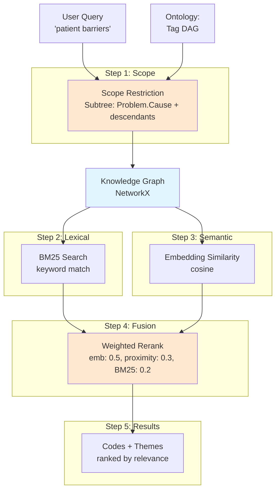
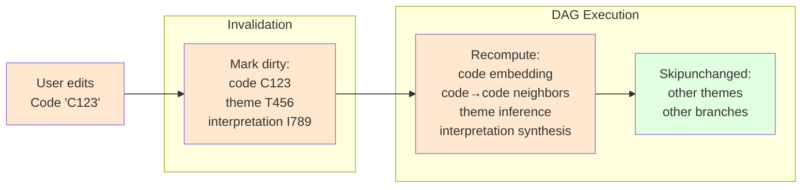

# Graph Retrieval & Evolution

The graph powers scope-aware retrieval and supports incremental evolution when entities are edited.

## Retrieval: Ontology-Aware Hybrid Search (ADR-006)

The graph powers scope-aware retrieval through a four-step pipeline:

**Scoring weights:**
- Embedding similarity: **0.5** (semantic relevance)
- Ontology proximity: **0.3** (tag inheritance depth)
- BM25 lexical: **0.2** (terminology match)

See `graph-data-model.md` for node/edge types used in retrieval.

## Incremental Evolution (ADR-007 + ADR-008)

When a code is edited, the system recomputes only the affected branch:

**Dirty flag propagation:**
- Edit code → invalidate its theme → invalidate interpretations containing that theme
- Merge two codes → invalidate both source codes → invalidate merged target → propagated downstream
- Hamilton DAG skips execution of clean nodes (cache hit)

See `graph-dual-representation.md` for traversal caching details that accelerate this process.
