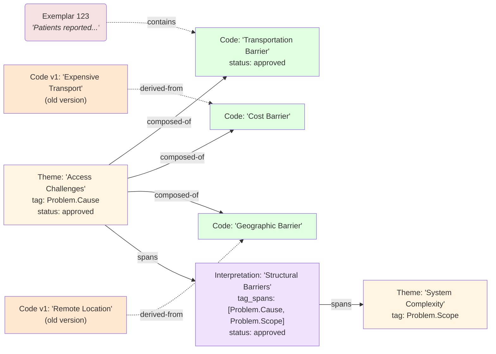

# Graph Usage & Performance

## Access the Graph

```python
from graph import get_graph, rebuild_graph

G = get_graph()  # lazy singleton
print(f"Nodes: {G.number_of_nodes()}, Edges: {G.number_of_edges()}")
rebuild_graph()  # force rebuild after bulk mutations
```

## Query Nodes

```python
node_id = 123
node_attrs = G.nodes[node_id]
print(node_attrs['type'], node_attrs['name'], node_attrs['status'])
```

## Traverse Edges

```python
theme_id = 456
codes = list(G.successors(theme_id))  # edge type = 'composed-of'

tag_id = 789
parents = list(G.predecessors(tag_id))  # edge type = 'parent-child'
```

## Inspect Edge Metadata

```python
edge_data = G.get_edge_data(source_id, target_id)
edge_type = edge_data['type']
metadata = edge_data.get('metadata')  # deserialized JSON or None
```

## Evidence Chain Example



**Chain traceability:** From interpretation down to raw exemplar quotes is always possible via graph traversal.

## Schema Migration Strategy

- **Version tracking** — `session_state` key `'schema_version'` (current = 1)
- **Forward-only migrations** — Applied sequentially via `duckdb_migrations.py`
- **Backward compatibility not guaranteed** — Recreate database if downgraded

## File Reference

**Graph module** (`src/python/graph/`): `builder.py` (DuckDB→NetworkX), `singleton.py` (lifecycle), `sync.py` (post-mutation sync), `__init__.py` (public API).

**Schema** (`src/python/persistence/duckdb_schema.py`): Table DDL for `nodes`, `edges`, `traversal_cache`, `session_state`, `user_actions`, `embedding_cache`.

**Documentation**: `src/python/graph/AGENTS.md` (module design), `ADR.md` (ADR-004, ADR-012, ADR-013), `PLANS.md` (features 11–16).

## Performance Targets

| Metric | Target | Current |
|--------|--------|---------|
| Build graph (10k nodes) | <5 seconds | ✅ (verified in test) |
| Traverse parent-child (single hop) | <10 ms | — |
| Subtree descendants (cached) | <5 ms | — (cache table exists, invalidation pending) |
| Sync single node | <20 ms | — (sync functions implemented, not yet integrated) |
